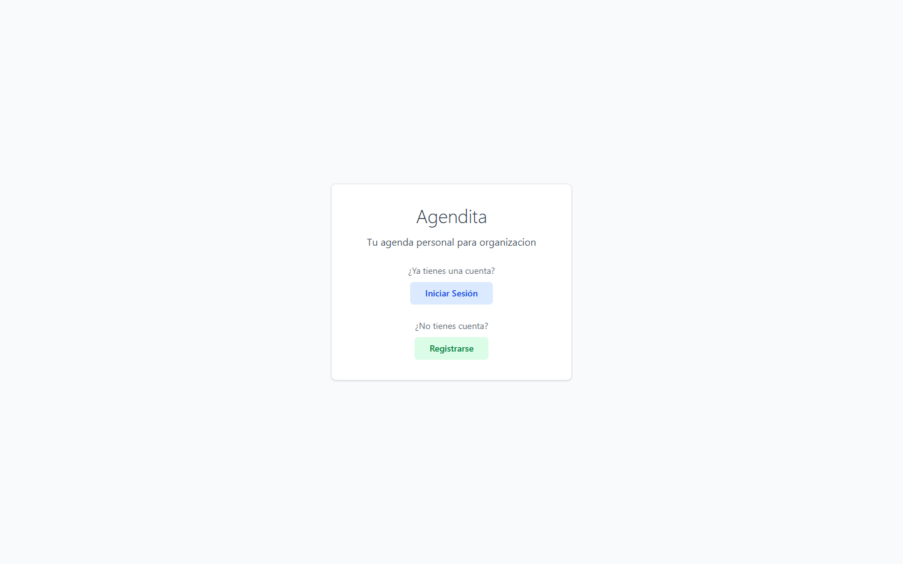
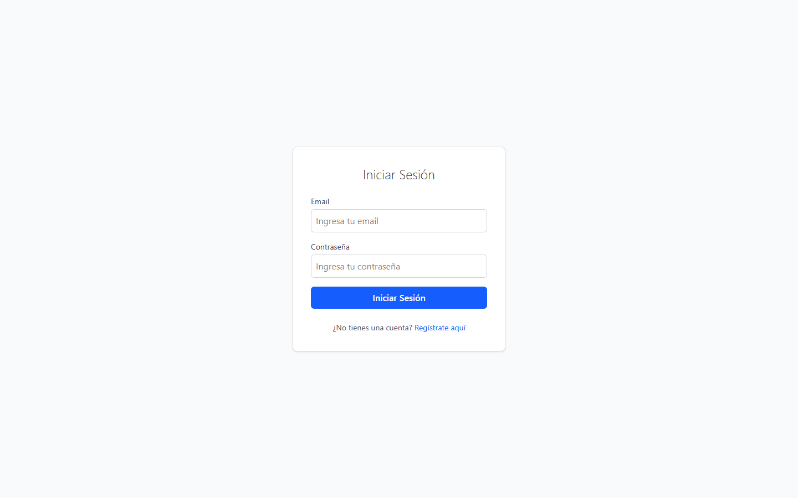
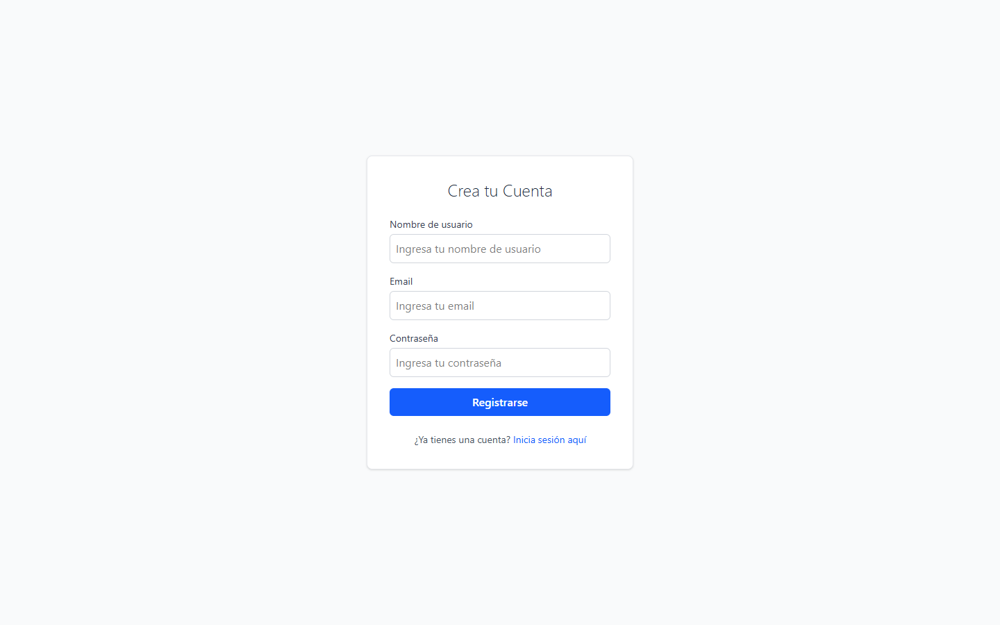
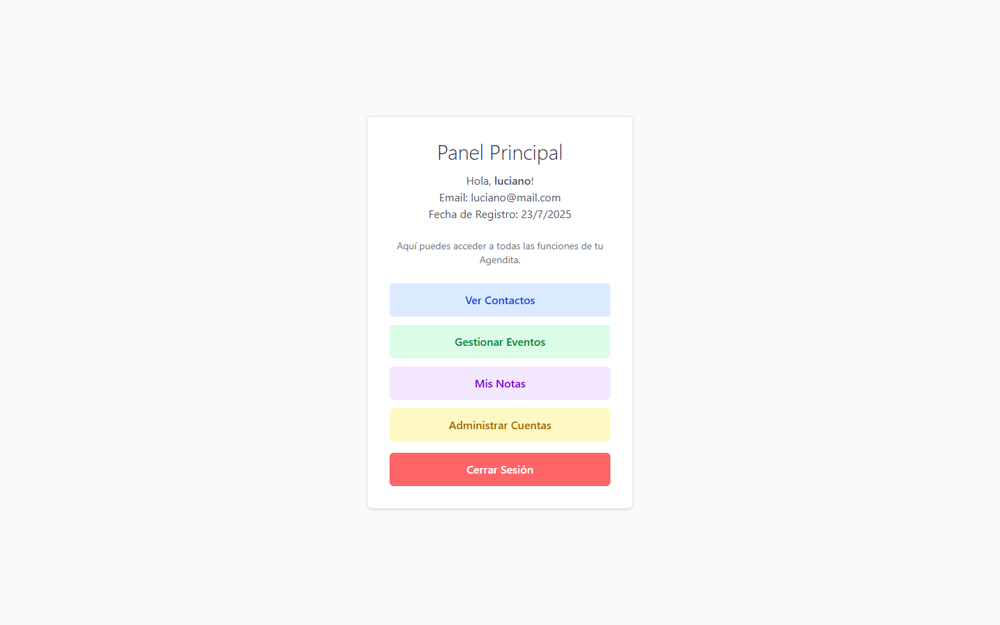
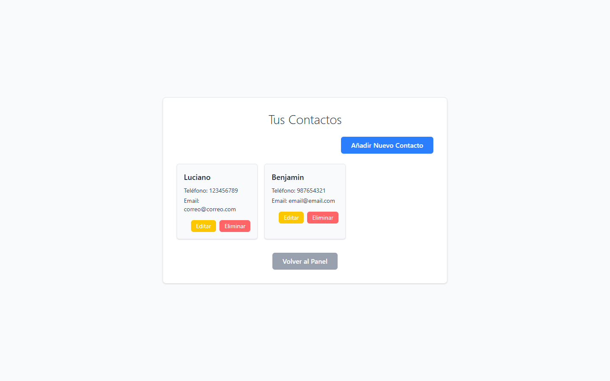
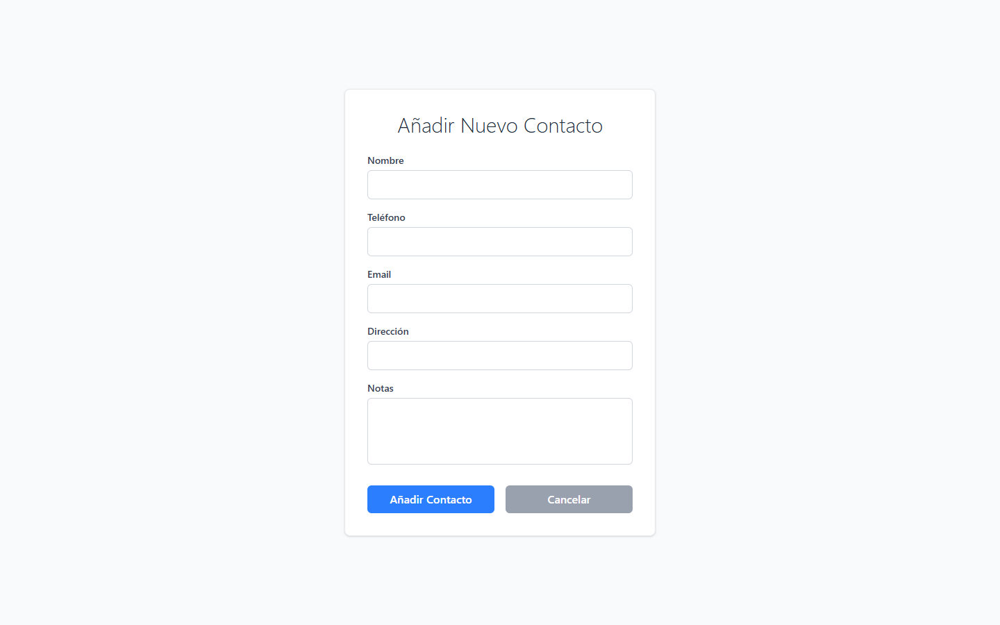
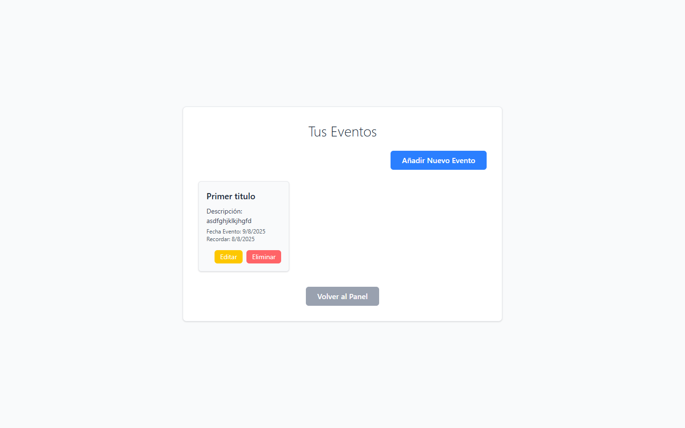
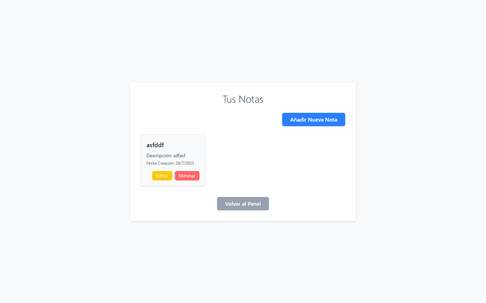
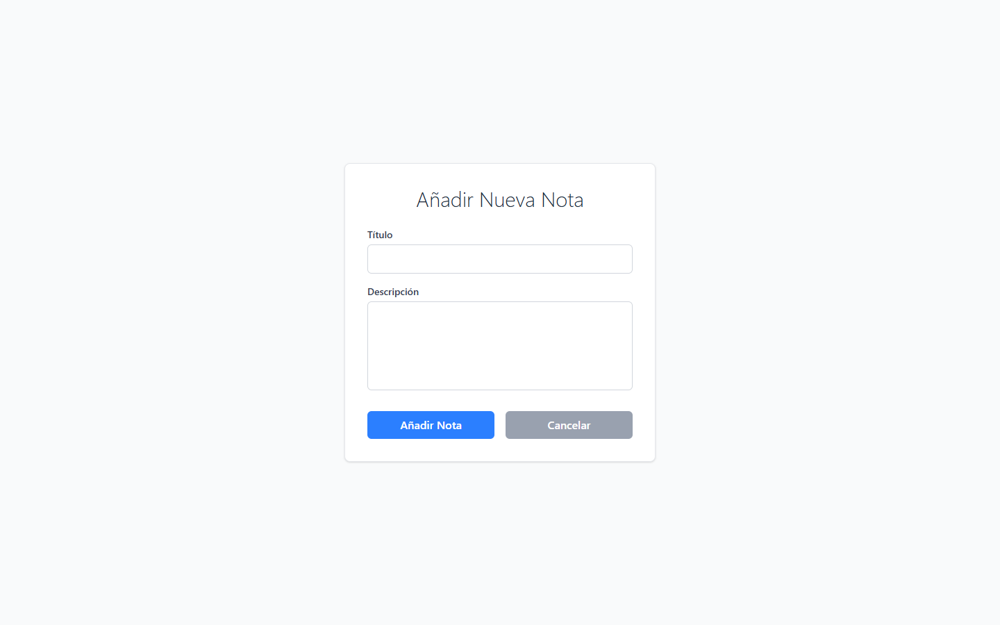
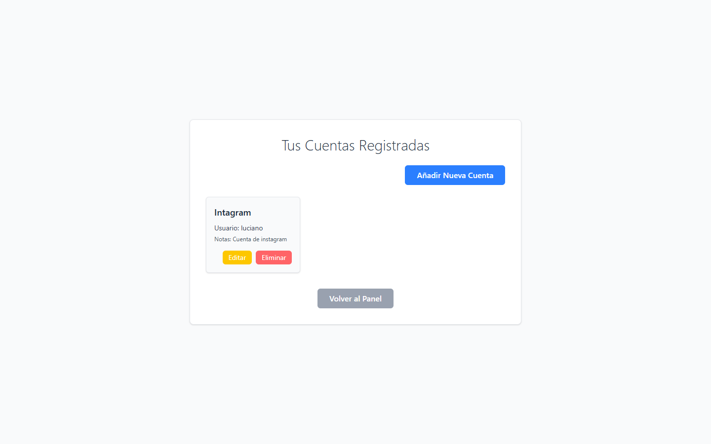

# Agendita App 🗓️

¡Bienvenido al repositorio de Agendita App! Esta es una aplicación web full-stack de agenda personal que te permite gestionar tus contactos, tareas, eventos y cuentas de manera eficiente.

---

### Vista Previa de la Aplicación

Aquí tienes algunas capturas de pantalla que muestran la funcionalidad principal.

#### Autenticación: Inicio, Login y Registro

Una interfaz limpia para empezar a organizar tu vida.

#### Panel Principal

El dashboard que los usuarios ven al iniciar sesión.

#### Gestión de Datos (CRUD)

Control total sobre tus contactos, eventos, notas y cuentas.

**Contactos**

**Eventos**

**Notas**

**Cuentas**

---

### Funcionalidades

-   **Autenticación de Usuarios**: Registro e inicio de sesión seguro.
-   **Contactos**: Módulo CRUD completo para la gestión de contactos.
-   **Eventos**: Módulo CRUD completo para la gestión de eventos.
-   **Notas**: Módulo CRUD completo para la gestión de notas.
-   **Cuentas**: Módulo CRUD completo para la gestión de cuentas.

---

### Tecnologías Utilizadas

-   **Frontend**: React, TailwindCSS.
-   **Backend**: Node.js, Express.
-   **Base de Datos**: MySQL.
-   **Herramientas**: Git, JSON Web Token (JWT) para autenticación.

---
